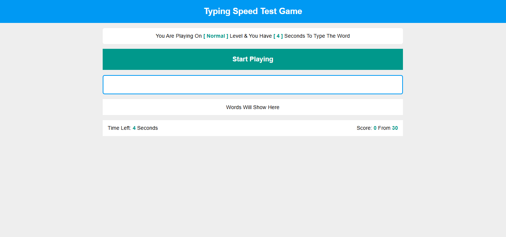

# Typing Speed Test Game

## Welcome! 👋

## Table of contents

- [Overview](#overview)
  - [Links](#links)
- [My process](#my-process)
  - [Built with](#built-with)
  - [Planned Features](#planned-features)
  - [Useful resources](#useful-resources)
- [Author](#author)
- [Acknowledgments](#acknowledgments)

## Overview

### Links

- Repository URL: [Repo URL](https://github.com/ilham-bouk/Typing_speed_test_game)
- Live Site URL: [Live Site](https://ilham-bouk.github.io/Typing_speed_test_game/)

## My process

### Built with

- Semantic HTML5 markup
- CSS custom properties
- JavaScript 
- Disktop-first workflow

## Planned Features

Here are some features we’re planning to add in future updates:
- **User Authentication**: Allow users to sign up, log in, and manage profiles.
- **Dark Mode**: Add a toggle for dark and light themes.
- **Responsive Design**: Optimize the app for mobile and tablet devices.
- **Performance Improvements**: Reduce load times and optimize resource usage.
- **Win function**:
- **Effects**: like: sounds, winner effect like sprinkles background.
- **Level**: add levels and make the user choose the level, also store the level in local storage.

### Useful resources

- [MDN Web Docs](https://developer.mozilla.org/en-US/docs/Web/CSS/)

## Author

- Frontend Mentor - [@ilham-bouk](https://www.frontendmentor.io/profile/ilham-bouk)
- LinkedIn - [Ilham Bouktir](https://www.linkedin.com/in/ilham-bouktir-0b266b31b)

## Acknowledgments

A big thank you to anyone providing feedback. It definitely helps to find new ways to code and find easier solutions!

**Happy coding!** ☺️🚀
